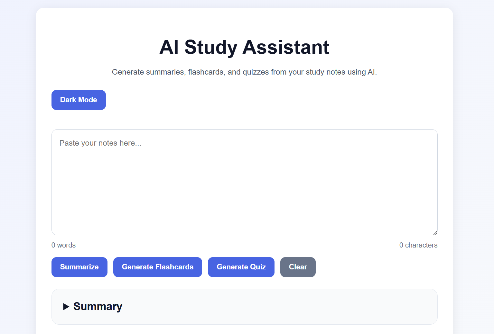
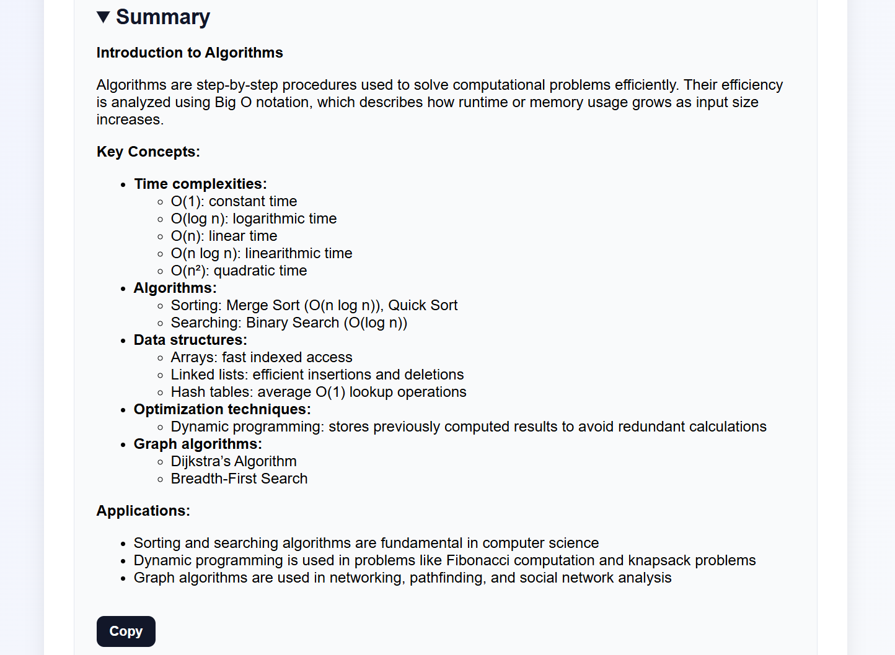
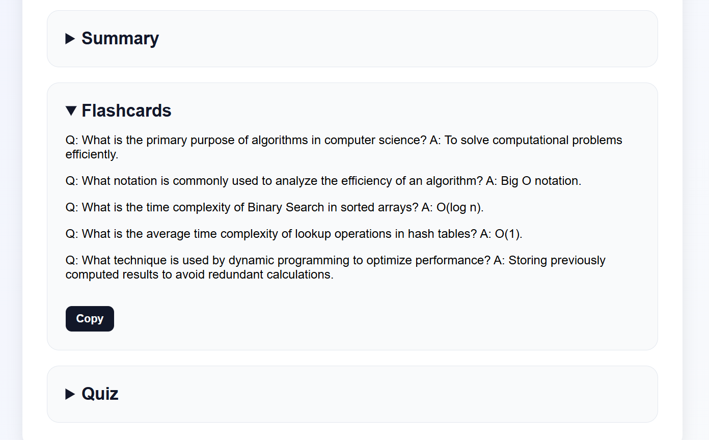
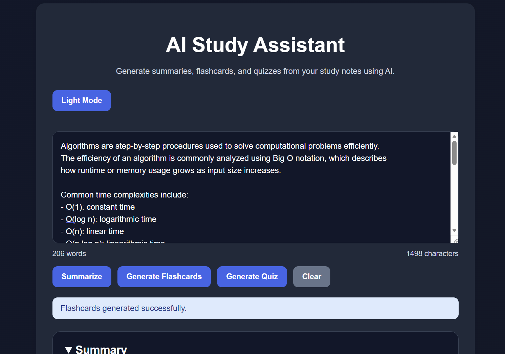

# AI Study Assistant

An AI-powered full-stack web application that generates summaries, flashcards, and quizzes from study notes using large language models.

## Live Demo

Frontend:
https://YOUR-VERCEL-URL.vercel.app

Backend API:
https://ai-study-assistant-ax6e.onrender.com

---

## Features

- AI-generated note summaries
- Flashcard generation
- Quiz generation
- Markdown-rendered AI responses
- Copy-to-clipboard functionality
- Dark mode with persistent theme storage
- Loading states and error handling
- Responsive modern UI
- Dockerized frontend and backend deployment

---

## Screenshots

### Main Interface



### AI Summary



### Flashcards



### Dark Mode



## Tech Stack

### Frontend
- React
- Vite
- CSS
- React Markdown

### Backend
- Node.js
- Express.js

### AI Integration
- Groq API
- Llama 3.3 70B

### Deployment
- Vercel
- Render
- Docker
- Docker Compose

---

## Installation

### Clone repository

```bash
git clone https://github.com/tohma-k/ai-study-assistant.git
cd ai-study-assistant
```

---

## Frontend Setup

```bash
npm install
npm run dev
```

Frontend runs on:

```text
http://localhost:5173
```

---

## Backend Setup

```bash
cd backend
npm install
node server.js
```

Backend runs on:

```text
http://localhost:5000
```

---

## Environment Variables

Create a `.env` file inside the `backend` directory:

```env
GROQ_API_KEY=your_api_key_here
```

---

## Docker Setup

Run the full application using Docker:

```bash
docker compose up --build
```

---

## Project Structure

```text
ai-study-assistant/
├── backend/
│   ├── server.js
│   ├── Dockerfile
│   └── .env
├── src/
├── Dockerfile
├── docker-compose.yml
├── package.json
└── README.md
```

---

## Future Improvements

- User authentication
- Saved study sessions
- PDF uploads
- Database integration
- Study history
- Mobile optimization

---

## License

MIT